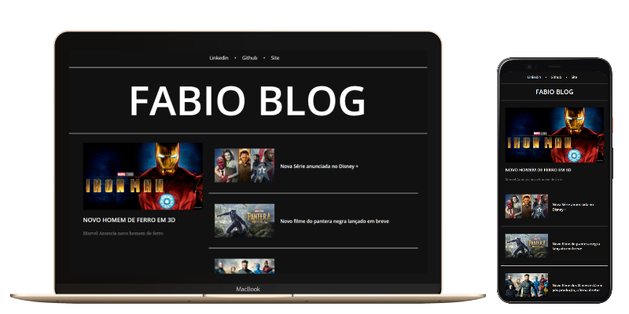

# Entrega de projeto - Criando um Blog com Angular | DIO

Este projeto é uma aplicação de blog totalmente funcional construída usando Angular. O principal objetivo deste projeto é demonstrar como construir componentes inteligentes e organizar efetivamente seu projeto Angular utilizando as ferramentas e recursos fornecidos pelo framework Angular.

## Tecnologias Utilizadas

- Angular
- CSS
- HTML

## Como Executar o Projeto

1. Clone o repositório:

   ```bash
   git clone https://github.com/fabiocasadossites/desafio-angular-blog-dio.git
   ```

2. Navegue até o diretório do projeto:

   ```bash
   cd nome-do-repositorio
   ```

3. Instale as dependências:

   ```bash
   npm install
   ```

4. Inicie o servidor de desenvolvimento:

   ```bash
   ng serve
   ```

5. Acesse o projeto no navegador:
   ```bash
   http://localhost:4200
   ```
